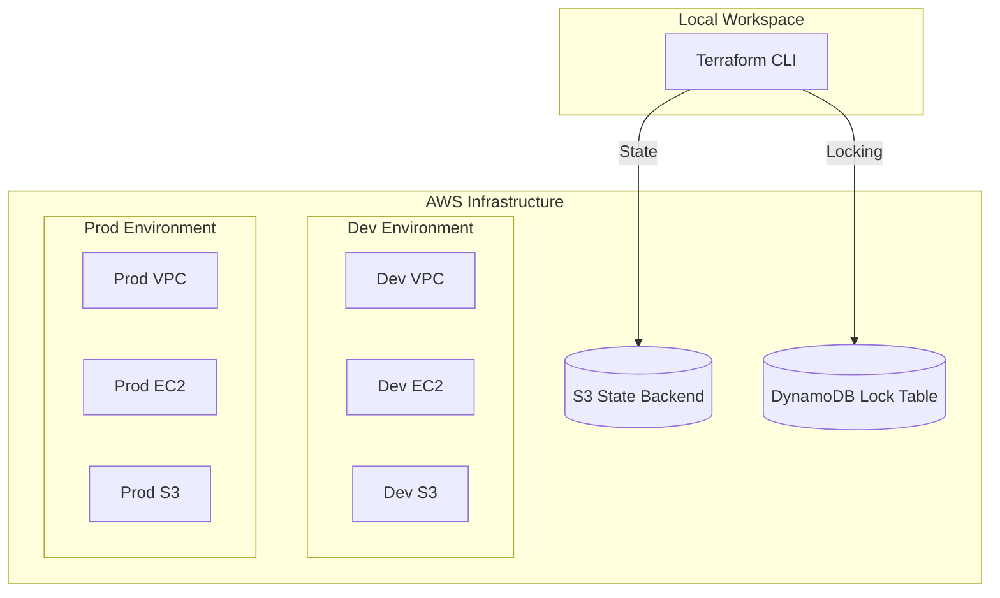

# 🌍 Terraform Multi-Environment State Lock


---

## 📖 Overview

This repository is a **production-ready** demonstration of Terraform best practices. It showcases how to manage infrastructure across multiple environments (**Dev & Prod**) with high reliability, using remote state management and state locking.

### 🌟 Key Features
- 🚀 **Multi-Environment Support:** Scalable configurations for `dev` and `prod`.
- 📦 **Modular Architecture:** Highly reusable modules for VPC, EC2, and S3.
- 🔐 **State Management:** Remote backend using **AWS S3** for state storage.
- 🔒 **Concurrency Protection:** **DynamoDB** state locking to prevent race conditions.
- 🏷️ **Naming Standard:** Industry-standard resource tagging and naming conventions.

---

## 🏗 Architecture

The infrastructure is designed for scalability and isolation.



---

## 📁 Project Structure

```text
Terraform-Multi-Env-State-Lock/
├── bootstrap/                  # 🏗 Infrastructure for TF Backend (S3 + DynamoDB)
├── modules/                    # 📦 Reusable Terraform Modules
│   ├── vpc/                    # Networking (VPC, Subnets, IGW)
│   ├── ec2/                    # Compute (Instances, Security Groups)
│   └── s3/                     # Storage (Environment-specific Buckets)
├── envs/                       # 🌍 Environment Configurations
│   ├── dev/                    # Development Workspace
│   └── prod/                   # Production Workspace
├── .gitignore                  # Git Ignore Rules
├── LICENSE                     # MIT License
└── README.md                   # Documentation (You are here)
```

---

## ✅ Prerequisites

Before you begin, ensure you have:

| Tool | Version | Purpose |
| :--- | :--- | :--- |
| **Terraform** | `v1.5.0+` | Logic & Orchestration |
| **AWS CLI** | `Latest` | AWS API Interaction |
| **IAM Permissions** | `PowerUser` | VPC, EC2, S3, DynamoDB access |

---

## 🚀 Getting Started

### 1️⃣ Step 1: Bootstrap the Backend
Set up the S3 bucket and DynamoDB table to store your Terraform state files.

```bash
cd bootstrap
terraform init
terraform apply -auto-approve
```

### 2️⃣ Step 2: Deploy to Development
Initialize the environment and link it to the remote backend.

```bash
cd ../envs/dev
terraform init
terraform plan
terraform apply -auto-approve
```

### 3️⃣ Step 3: Deploy to Production
Production uses isolated CIDR blocks and high-availability settings.

```bash
cd ../envs/prod
terraform init
terraform plan
terraform apply -auto-approve
```

---

## 🧩 Modules Deep Dive

### 🌐 VPC Module
*   **Purpose:** Creates a modular network stack.
*   **Inputs:** `project_name`, `environment`, `vpc_cidr`.
*   **Outputs:** `vpc_id`, `public_subnets`.

### 🖥️ EC2 Module
*   **Purpose:** Deploys compute resources within the VPC.
*   **Inputs:** `instance_type`, `ami_id`, `subnet_id`.
*   **Outputs:** `instance_public_ip`.

### 🪣 S3 Module
*   **Purpose:** Provision environment-specific storage.
*   **Inputs:** `bucket_name_prefix`.
*   **Outputs:** `bucket_arn`.

---

## 🏷️ Naming Convention

We follow a strict naming convention to prevent resource collisions:
`{project}-{environment}-{resource-name}`

**Examples:**
- `platform-dev-vpc`
- `platform-prod-web-server`
- `platform-prod-state-bucket`

---

## 🎓 Learning Outcomes

*   [x] Mastering **Remote State Management**.
*   [x] Implementing **State Locking** for collaborative teams.
*   [x] Structuring **Multi-Env** Terraform folders.
*   [x] Building **Reusable Modules** from scratch.
*   [x] Adhering to **Best Practices** for Enterprise IaC.

---

## 📄 License

This project is licensed under the **MIT License**. See [LICENSE](LICENSE) for details.

---

## 🤝 Connect & Support

Built with ❤️ by **[Your Name]**

[](https://github.com/YourUsername)
[](https://linkedin.com/in/YourUsername)

---
*If you found this helpful, please star ⭐ the repository!*
